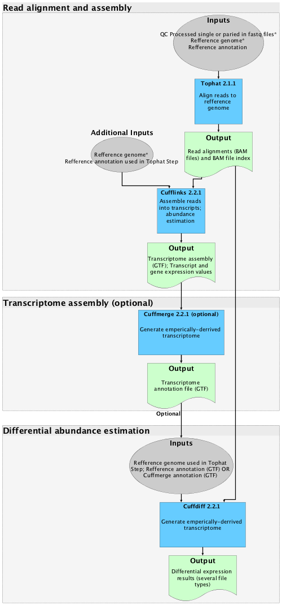

.. image:: ./img/cyverse_rgb.jpg

Tutorial Name
=============

--------------

Goal
----

-  One-two sentences describing the ultimate goal of the steps in this
   tutorial

--------------

Prerequisites and example data
~~~~~~~~~~~~~~~~~~~~~~~~~~~~~~

Short description

*In order to complete this tutorial you will need to have the following
inputs prepared*

+-----------------+----------+---------------------+----------------+
| Input file(s)   | Format   | Preparation/Notes   | Example data   |
+=================+==========+=====================+================+
|                 |          |                     |                |
+-----------------+----------+---------------------+----------------+

**Example data citation:**

--------------

Platform and tools
------------------

**CyVerse Platform(s):**

+-----------+------------+-------+-------------------------+
| Platform  | Interface  | Link  | Platform Documentation  |
+===========+============+=======+=========================+
| Discovery | Web        | `http | `Manual <https://pods.i |
| Environme | (Point-and | s://d | plantcollaborative.org/ |
| nt        | -click)    | e.ipl | wiki/display/DEmanual/T |
|           |            | antco | able+of+Contents>`__    |
|           |            | llabo |                         |
|           |            | rativ |                         |
|           |            | e.org |                         |
|           |            | /de/  |                         |
|           |            | <http |                         |
|           |            | s://d |                         |
|           |            | e.ipl |                         |
|           |            | antco |                         |
|           |            | llabo |                         |
|           |            | rativ |                         |
|           |            | e.org |                         |
|           |            | />`__ |                         |
+-----------+------------+-------+-------------------------+
| Atmospher | Command-li | [http | `Manual <https://pods.i |
| e         | ne         | s://a | plantcollaborative.org/ |
|           | AND/OR     | tmo.c | wiki/display/atmman/Atm |
|           | VNC/Deskto | yvers | osphere+Manual+Table+of |
|           | p          | e.org | +Contents>`__           |
|           | (Point-and |       |                         |
|           | -click)    |       |                         |
+-----------+------------+-------+-------------------------+
| BisQUE    | Web        | http: | `Manual <https://pods.i |
|           | (Point-and | //bis | plantcollaborative.org/ |
|           | -click)    | que.i | wiki/display/BIS/Using+ |
|           | AND/OR     | plant | the+BisQue+Image+Analys |
|           | Command-li | colla | is+System>`__           |
|           | ne         | borat |                         |
|           |            | ive.o |                         |
|           |            | rg/cl |                         |
|           |            | ient_ |                         |
|           |            | servi |                         |
|           |            | ce/   |                         |
+-----------+------------+-------+-------------------------+
| Agave API | Web,       | https | `Documentation          |
|           | Command-li | ://ag | website <https://agavea |
|           | ne         | aveap | pi.co/>`__              |
|           |            | i.co/ |                         |
+-----------+------------+-------+-------------------------+

**Discovery Environment App(s):**

+------------+-----------+-----------------------------+-----------------------------------------------------------------------------------------------------------+
| App name   | Version   | Description                 | App Link                                                                                                  |
+============+===========+=============================+===========================================================================================================+
| Muscle     | 3.8.31    | Multiple sequence aligner   | `Link <https://de.iplantcollaborative.org/de/?type=apps&app-id=9b41c9e4-5031-4a49-b1cb-c471335df16e>`__   |
+------------+-----------+-----------------------------+-----------------------------------------------------------------------------------------------------------+

**Atmosphere Image(s):**

+-------------+----------+--------------+-------+
| Image name  | Version  | Description  | Link  |
+=============+==========+==============+=======+
| CyVerse     | 1.0      | base image   | https |
| CentOS 6.8  |          | for CentOS   | ://at |
| GUI Base    |          | 6.8 with     | mo.cy |
|             |          | GNOME GUI    | verse |
|             |          | Desktop      | .org/ |
|             |          |              | appli |
|             |          |              | catio |
|             |          |              | n/ima |
|             |          |              | ges/1 |
|             |          |              | 384   |
+-------------+----------+--------------+-------+

--------------

Overview
--------

.. raw:: html

   <!---
   Text and workflow image go here
   --->
   

--------------

Directions
----------

.. raw:: html

   <!---

   Style recommendations for DE:

   1. Steps generally begin with a verb or preposition:

       "Click on the XXXX button" OR  "Under the 'Results Menu'"

   2. Locations parenthetical and separated by carets. Locations not preceded by (semi)colons don't use parenthesis. (optional: ultimate object in bold):

       "(Username > analyses > output)" OR "Output is located at: Username >                 
       analyses > **output**"
       
   3. Buttons and key words in bold:
       "Click on **Apps**" or "Select **Arabidopsis**"

   4. App accordion menu titles in double quotes

   5. App header description in single quotes

   --->

Subsection 1 name
~~~~~~~~~~~~~~~~~

| **Task:**
| 

**Inputs outputs:**

+--------+---------------+-----------------+
| File   | Description   | Example input   |
+========+===============+=================+
|        |               |                 |
+--------+---------------+-----------------+

.. raw:: html

   <!---
   Steps and text go here
   --->

**Expected outputs:**

+--------+---------------+------------------+
| File   | Description   | Example output   |
+========+===============+==================+
|        |               |                  |
+--------+---------------+------------------+

--------------

Subsection 2 name
~~~~~~~~~~~~~~~~~

| **Task:**
| 

**Inputs outputs:**

+--------+---------------+-----------------+
| File   | Description   | Example input   |
+========+===============+=================+
|        |               |                 |
+--------+---------------+-----------------+

.. raw:: html

   <!---
   Steps and text go here
   --->

**Expected outputs:**

+--------+---------------+------------------+
| File   | Description   | Example output   |
+========+===============+==================+
|        |               |                  |
+--------+---------------+------------------+

--------------

Subsection 3 name
~~~~~~~~~~~~~~~~~

| **Task:**
| 

**Inputs outputs:**

+--------+---------------+-----------------+
| File   | Description   | Example input   |
+========+===============+=================+
|        |               |                 |
+--------+---------------+-----------------+

.. raw:: html

   <!---
   Steps and text go here
   --->

**Expected outputs:**

+--------+---------------+------------------+
| File   | Description   | Example output   |
+========+===============+==================+
|        |               |                  |
+--------+---------------+------------------+

--------------

Subsection 4 name
~~~~~~~~~~~~~~~~~

| **Task:**
| 

**Inputs outputs:**

+--------+---------------+-----------------+
| File   | Description   | Example input   |
+========+===============+=================+
|        |               |                 |
+--------+---------------+-----------------+

.. raw:: html

   <!---
   Steps and text go here
   --->

**Expected outputs:**

+--------+---------------+------------------+
| File   | Description   | Example output   |
+========+===============+==================+
|        |               |                  |
+--------+---------------+------------------+

--------------

Summary
-------

.. raw:: html

   <!---
   Summary and example figures
   --->

**Next Steps:**

--------------

Additional background and reading
---------------------------------

Short description and links to any reading materials
